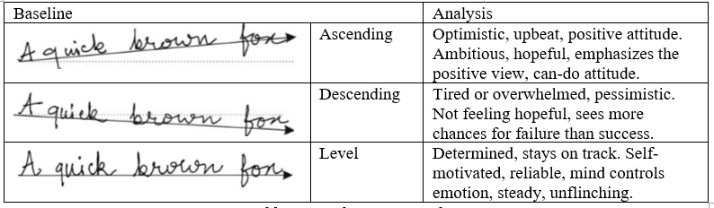
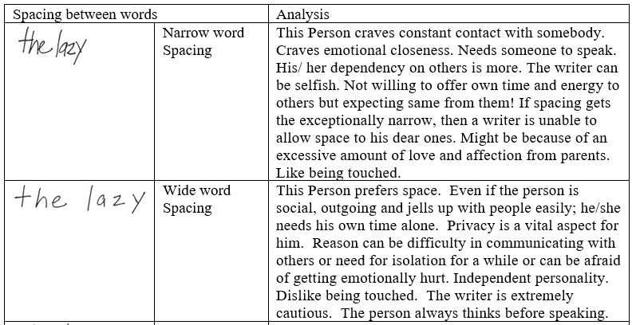
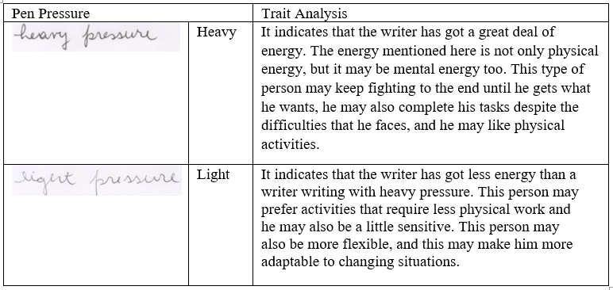
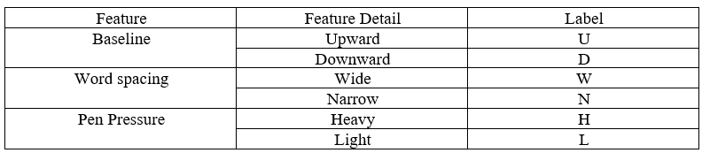
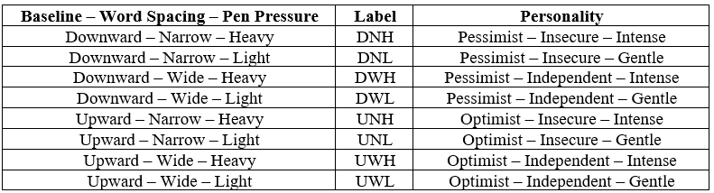

# Behaviour Prediction based on Handwriting using Machine Learning

The aim of this project is to develop a predictive model to reveal the personality traits of a person based on their handwriting. 
### The handwriting features taken into consideration are as follows: ###

1. Baseline - the imaginary line on a blank paper which touches the base of each word

2. Word spacing - the distance between the end of a word and the starting of next word

3. Pen pressure - the amount of energy a person puts in to write

These features indicate the **social** and **emotional behavioural traits** of a person. 

### Notable Libraries Used: ###

1. Computer Vision - cv2

2. Scientific Computing - scipy

3. Image processing - imutils

4. Plotting - matplotlib

### Steps: ###

1. Dataset: _CVL dataset_ which consist over 11K images of handwriting samples.

2. Manual Labelling: Based on research on Graphology, I manually labelled each handwriting sample with the features and later mapped it to the traits.

Table: Feature – Label Mapping

Table: Personality – Label Mapping

3. Feature vectors: Once the labelled dataset was ready, using imutils package's image processing functions, the feature vectors were calculated from the image.

**3.1. Baseline** - For this, the starting points of the line (left-most point) is taken as (x1,y1) and the end point of the line (right-most point) is taken as (x2,y2) and the proportional slope of the line calculated using the formula – (y2 – y1).

**3.2. Word Spacing** - Average word spacing = | Sum of distances between words ÷ Number of words |

**3.3. Pen Pressure** - Otsu’s thresholding method, grey scale values ranges from 0 to 255, 0 for black pixels and 255 for white.

4. Trait mapping: The feature vectors are normalized and mapped to the human traits based on the manual labelling.

5. Model building: The obtained dataset was then fed to various machine learning models to test for performance and prediction accuracy.

